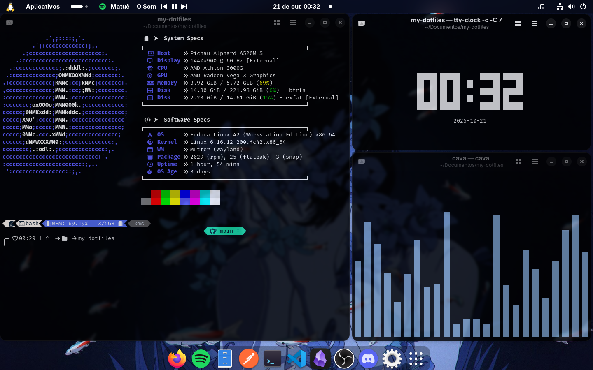

<p align="center">
  <h1>✯ My Dotfiles ✯</h1>
</p>

<p align="center">
  This repository contains my personal configuration files (dotfiles) and the necessary documentation to quickly replicate my Linux work environment, focused on aesthetics and productivity on <strong>Fedora (GNOME Desktop)</strong>.
</p>

<div align="center">
  
</div>

## Repository Contents

| Configuration | File in Repo | Description |
| :--- | :--- | :--- |
| **Terminal (Visual)** | `config.jsonc` (Fastfetch)<br> `config` (Cava) | Configuration for Fastfetch (system info tool) and Cava (audio visualizer). |
| **GNOME Desktop** | `extensions-gnome.txt` | List of installed GNOME Shell Extension IDs. |
| **VS Code** | `vscode-settings.json`<br> `vscode-keybindings.json` | User settings and custom keybindings for Visual Studio Code. |
| **VS Code (Exts)** | `extensions-vscode.txt` | List of extensions for automatic reinstallation. |
| **Wallpaper** | `wallpaper.png` | My default desktop background image. |

---

## 🛠️ Installation Guide

Follow these steps to set up your new system using these dotfiles.

### 1. Clone the Repository

First, clone this repository to the designated location (`~/Documents/`):

```bash
# Navigate to the Documents folder
cd ~/Documents

# Clone the repository
git clone [https://github.com/caioreis29974/my-dotfiles.git](https://github.com/caioreis29974/my-dotfiles.git)

# Enter the folder
cd my-dotfiles
```

### 2. Create Symlinks (Symbolic Links)

To make your applications use the config files from this repository, you must create symlinks (shortcuts) pointing from the original config location to the file inside this repository.

#### Fastfetch and Cava

The symlinks should point to the configuration files inside `~/.config/`:

``` bash
  # Link for Fastfetch
ln -s ~/Documents/my-dotfiles/config.jsonc ~/.config/fastfetch/config.jsonc

# Link for Cava
ln -s ~/Documents/my-dotfiles/config ~/.config/cava/config

```

If the `fastfetch` or `cava` folders do not exist in `~/.config/`, create them first.

#### VS Code

The symlinks should point to the user configuration folder:

``` bash
  # Link for settings.json
ln -s ~/Documents/my-dotfiles/vscode-settings.json ~/.config/Code/User/settings.json

# Link for keybindings.json
ln -s ~/Documents/my-dotfiles/vscode-keybindings.json ~/.config/Code/User/keybindings.json

```

### 3. Configure Extensions and Wallpaper

#### VS Code (Extensions Reinstallation)

The `extensions-vscode.txt` file contains a list of all your extensions. You can automatically reinstall them with a single command:

``` bash
  cat ~/Documents/my-dotfiles/extensions-vscode.txt | xargs -L 1 code --install-extension

```

#### GNOME Shell Extensions

The `extensions-gnome.txt` file lists the IDs of the installed GNOME extensions. GNOME does not have a simple command for bulk installation, so you should use this file as a reference to manually reinstall them (usually via `extensions.gnome.org` or the `Extensions` app).

#### Wallpaper

Move the wallpaper file to your preferred image directory, or set the path directly to the file inside the repo.

#### Option (Move the file):

### Copy the file to your Pictures folder

``` bash
cp ~/Documents/my-dotfiles/My Wallpaper/wallpaper.png ~/Pictures/
```

---

<div align="center">
  <p>Made with ❤️ by <a href="https://github.com/caioreis29974">CaioXyZ</a></p>
  <p>Inspired by many amazing setups from the Linux community</p>
  <p>⭐ This repository if you liked it!</p>
</div>
